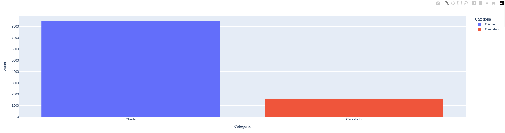
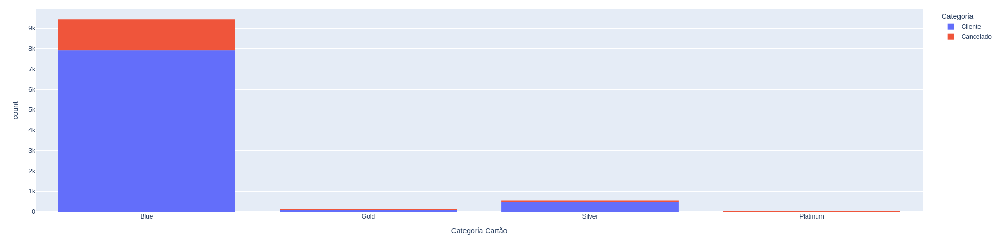
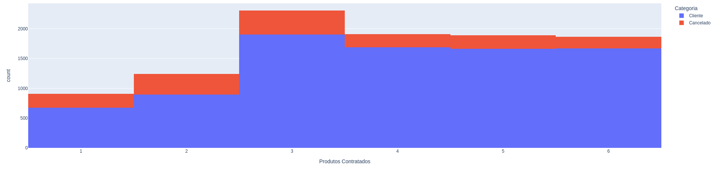
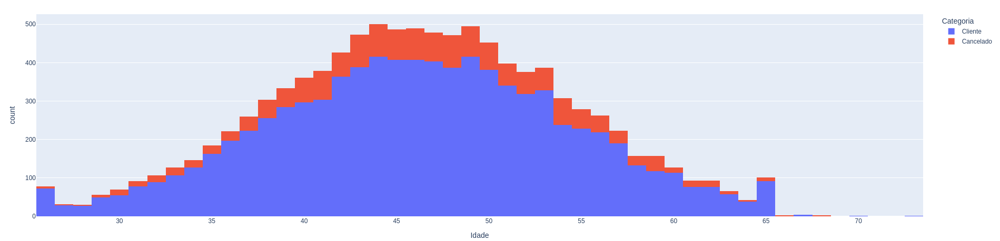
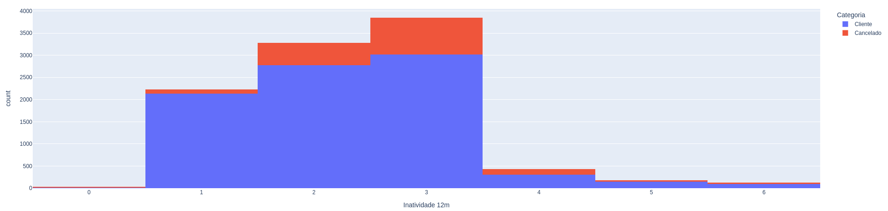
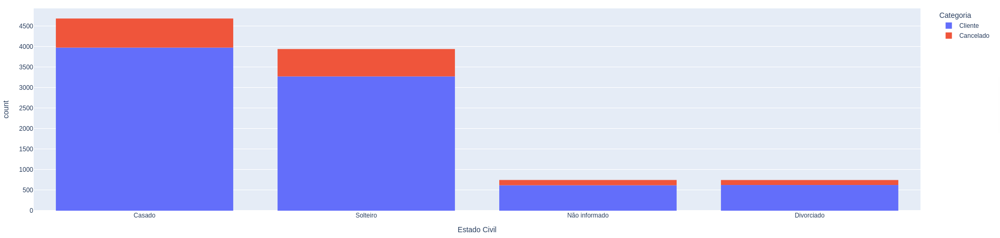

# Análise de Churn — Cartões de Crédito

## Sobre o Projeto

Este projeto foi desenvolvido com o objetivo de analisar os principais fatores que levam clientes a cancelarem seus cartões de crédito (Churn).
Através da exploração e análise exploratória dos dados (EDA), foram identificados padrões comportamentais que influenciam diretamente a decisão de cancelamento.

## Objetivo

Identificar variáveis relevantes para o cancelamento de clientes e propor soluções estratégicas para aumentar a retenção.

## Principais Insights

### 1. Quanto mais produtos contratados, menor a chance de churn
Clientes com maior número de produtos vinculados à instituição apresentam menor probabilidade de cancelamento.

**Interpretação:**  
Maior relacionamento com a empresa aumenta a fidelização.

### 2. Baixo uso do cartão aumenta a chance de churn
Clientes que utilizam pouco o cartão possuem maior tendência ao cancelamento.

**Interpretação:**  
Baixo engajamento pode indicar menor percepção de valor.

### 3. Alto número de contatos com atendimento aumenta a chance de churn
Clientes que entram em contato muitas vezes com o suporte tendem a cancelar mais.

**Interpretação:**  
Possíveis falhas na experiência do cliente ou insatisfação com o serviço.

## Possíveis Soluções

### Incentivos ao Uso
- Programas de cashback  
- Benefícios progressivos  
- Campanhas de engajamento  

### Ofertas Personalizadas
- Promoções para clientes com baixo uso  
- Isenção temporária de anuidade  
- Ações direcionadas por perfil  

### Melhoria no Atendimento
- Redução do tempo de resposta  
- Monitoramento de chamados recorrentes  
- Treinamento da equipe de suporte  

## Ferramentas Utilizadas
- Python  
- Pandas  
- Plotly 
- Google Colab

## Gráficos da Análise de Churn
Aqui apresento os principais gráficos que ilustram os insights do projeto.

### Distribuição de clientes ativos vs cancelados

### Categorias de cartões mais canceladas

**Insight:** Clientes com certos tipos de cartão apresentam maior taxa de cancelamento, indicando oportunidades de melhoria ou ofertas personalizadas.

### Produtos contratados vs cancelamento

**Insight:** Clientes com maior número de produtos contratados apresentam menor taxa de cancelamento, indicando que um relacionamento mais amplo aumenta a fidelização.

### Distribuição de idade dos clientes

### Inatividade por 12 meses

**Insight:** Clientes com maior período de inatividade nos últimos 12 meses apresentam maior tendência ao cancelamento, sinalizando risco de churn.

### Estado civil dos clientes

## Impacto Esperado
- Redução da taxa de churn  
- Aumento da retenção de clientes  
- Maior engajamento e LTV (Lifetime Value)  

**Projeto desenvolvido como prática de Análise de Dados focada em retenção de clientes.**
